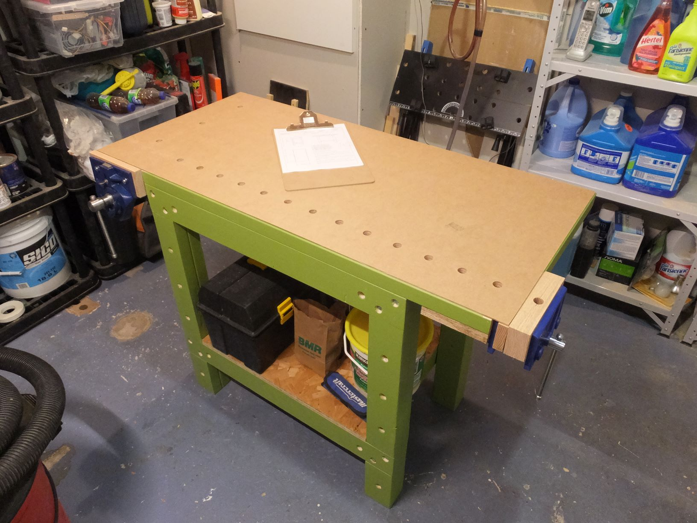
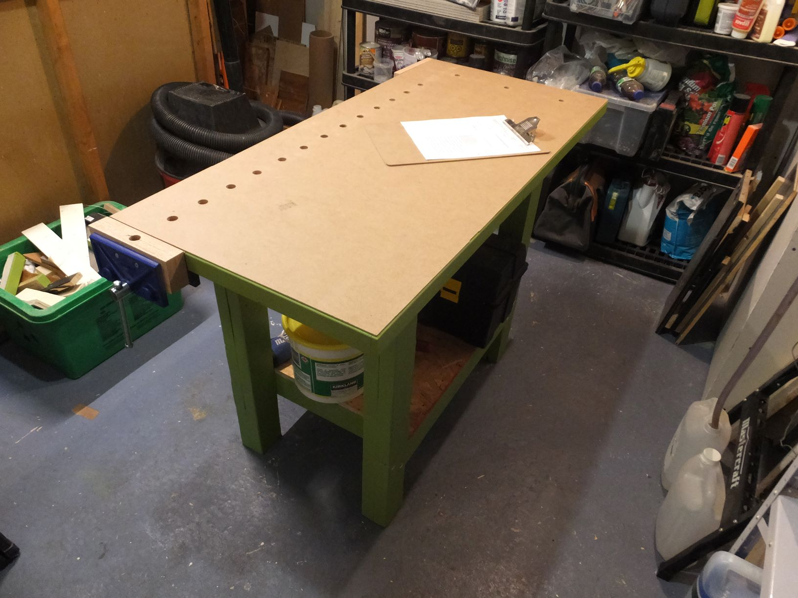

# Établi de menuisier
Ce projet est un établi de menuisier (code de projet WB1) pour la réalisation de meubles de dimensions moyennes comme une table de chevet, un petit bureau, mais pas une table de cuisine.

Il est construit avec des matériaux aux dimensions courantes en Amérique du Nord et des méthodes de fixation simples.

D'un côté de l'établi, sur la face avant, le plan de travail affleure les pattes de l'établi afin de pouvoir fixer des panneaux à la verticale et utiliser un étau de menuisier. De l'autre côté, il dépasse de 3" afin de permettre l'utilisation de serre-joints.
 

# Matériaux
Si vous ne faites aucune erreur de coupe, vous aurez besoin de :

* (1) Madrier 2x3x8'
* (5) Madrier 2x4x8'
* (2) Panneau de contreplaqué 3/4"x2'x4'
* (1) Panneau d'OSB 3/4"x2'x4'
* (1) Panneau dur 1/8"x2'x4'

L'établi en photo a été réalisé en épinette.

# Quincaillerie
Hormis les étaux, vous aurez besoin de :

* (16) Tire-fond 1/4"x2 1/2"
* (16) Rondelle plate 1/4"
* Clous 1 1/2"
* Clous de finition 1 1/4"
* Clous de finition 1 1/2"
* Colle à bois
* Vis à bois #8 1 1/4"
* Vis à bois #8 2 1/2"
* Vis pour trou en angle #8 2 1/2"

# Outils nécessaires
Hormis les outils de base (p. ex. ruban à mesurer), vous aurez également besoin de :

* Banc de scie pour découper les moulures;
* Gabarit pour faire des trous en angle;
* Perceuse/visseuse;
* Scie à onglet pour découper précisement les madriers;
* Scie circulaire pour découper les panneaux.

# Liste des documents
* WB1-ASY-001.pdf : dessin d'ensemble du projet avec la liste des pièces;
* WB1-MFG-001.pdf : le coût du projet (estimé et réel);
* WB1-MFG-002.pdf : la fiche de débit;
* WB1-PRT-XYZ.pdf : le dessin de définition de la pièce numéro XYZ (notez que les pièces triviales n'ont pas de dessin de définition);
* WB1-REQ-001.pdf : le cahier des charges.

# Environnement de développement
* Windows 10 comme système d'exploitation;
* QCAD Professional pour les dessins techniques;
* LibreOffice 6.* pour les documents;
* PDFtk pour manipuler les fichiers PDF;
* Visual Studio Build Tools 2019 pour les outils de développement de base.

# Construire les artefacts
Avec l'environnement de développement correct, il vous suffit de lancer la commande "nmake" depuis une invite de commande de développeur pour Visual Studio 2019 ("Developer Command Prompt for VS 2019") à la racine du projet. Les documents seront générés dans le répertoire "build".

En cas d'erreurs "'X' n'est pas reconnu en tant que commande interne ou externe [...]", vérifiez que les exécutables de LibreOffice, QCAD, PDFtk sont dans votre PATH.
